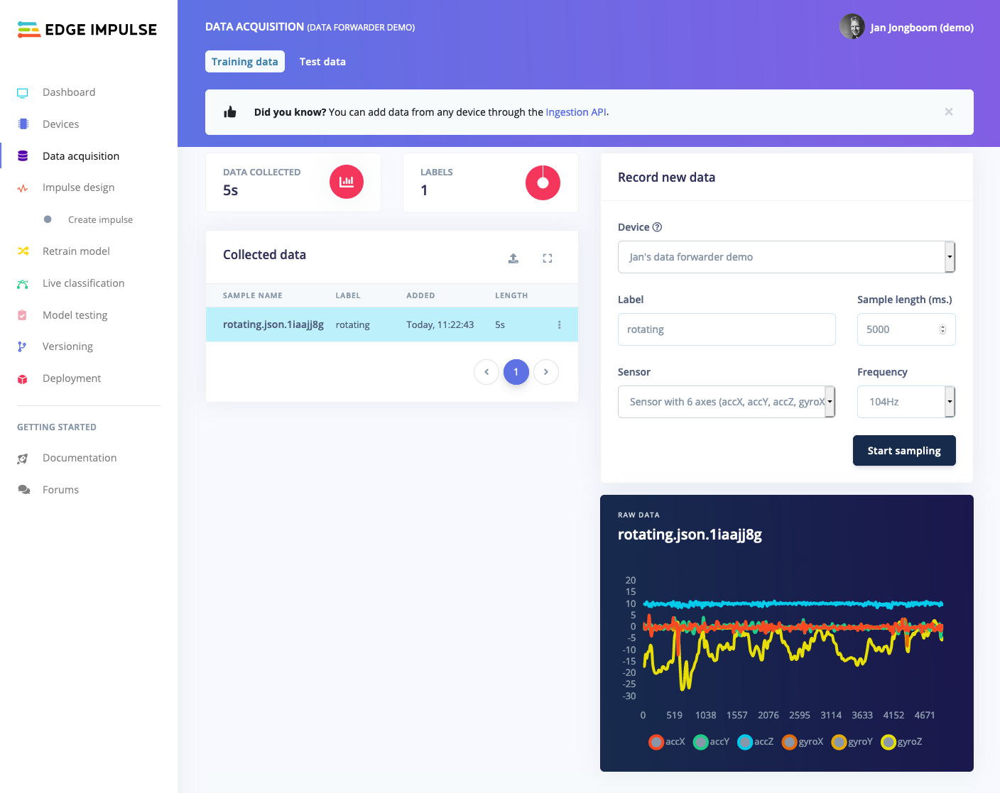

# Data Forwarder example (Mbed OS)

An example firmware for the ST IoT Discovery Kit showing how to use the [Edge Impulse Data Forwarder](https://docs.edgeimpulse.com/docs/cli-data-forwarder) to capture data from the IMU sensor at 104Hz and send it to Edge Impulse.

## How to build

1. Install the [Edge Impulse CLI](https://docs.edgeimpulse.com/docs/cli-installation).
1. Clone this repository:

    ```
    $ mbed import https://github.com/edgeimpulse/example-dataforwarder-mbed
    ```

1. Build and flash this application:

    ```
    $ cd example-dataforwarder-mbed
    $ mbed compile -t GCC_ARM -m DISCO_L475VG_IOT01A -f
    ```

1. Run the data forwarder (use `--clean` to set a new project):

    ```
    $ edge-impulse-data-forwarder
    ```

1. Your device is now connected in Edge Impulse, and you can sample data!

    
